```mermaid
graph TB

%% =========================
%% BOOMBRIDGE Website Sitemap (priority-ordered + color-coded)
%% High = MVP (green) | Low = Future (blue)
%% =========================

A[Homepage - MVP]

%% --- MVP (High) ---
subgraph B[Dashboard — MVP 1]
  B1[User Profile]
  B2[Order Tracking]
  B3[Performance Report]
end

subgraph C[Products & RFQ — MVP 2]
  C1[Product Catalog]
  C2[Quotation Request]
  C3[Quotation Response]
end

subgraph D[Payments & Wallet — MVP 3]
  D1[Wallet Overview]
  D2[Transaction History]
  D3[Payment Options]
end

subgraph E[Contact & Support]
  E1[FAQ]
  E2[Contact Form]
  E3[Live Chat]
end

%% --- Phase 2 (Medium) ---
subgraph F[Suppliers — Phase 2]
  F1[Supplier List]
  F2[Supplier Details]
  F3[Ratings and Reviews]
end

subgraph G[Logistics — Phase 2]
  G1[Delivery Tracking]
  G2[Partner Integration]
end

subgraph H[Admin Dashboard — Phase 2]
  H1[User Management]
  H2[KPI Analytics]
end

%% --- Future (Low) ---
subgraph I[BIM Integration]
  I1[BIM Object Library]
  I2[Model Integration View]
end

subgraph J[AI Recommendations]
  J1[Recommended Suppliers]
  J2[Material Suggestions]
end

%% Top-level links from Homepage (kept light; subgraphs show containment)
A --- B
A --- C
A --- D
A --- E
A --- F
A --- G
A --- H
A --- I
A --- J

%% =========================
%% Color styles by priority
%% =========================
classDef high   fill:#b9f6ca,stroke:#2e7d32,stroke-width:1px,color:#000;
classDef medium fill:#fff59d,stroke:#f9a825,stroke-width:1px,color:#000;
classDef low    fill:#bbdefb,stroke:#1565c0,stroke-width:1px,color:#000;

%% Apply to section headers (and their inner nodes for broader effect)
class B,C,D,E high;
class F,G,H,I,J low;

class B1,B2,B3,C1,C2,C3,D1,D2,D3,E1,E2,E3 high;
class F1,F2,F3,G1,G2,H1,H2,I1,I2,J1,J2 low;
```

# BOOMBRIDGE

## Website Sitemap Structure

---

## Website Sitemap Structure

---

## Development Timeline (12 Weeks Plan)  

| Week | Milestone | Description |
|:----:|------------|-------------|
| **1–2** | Requirement Gathering & System Design | Define user stories, database schema, and architecture. |
| **3–4** | UI/UX Mockups & Visual Design | Develop web layout and prototype user flows. |
| **5–7** | Backend Development | Build core logic, APIs, and database integration. |
| **8–9** | Frontend Development | Connect frontend with APIs, implement wallet and RFQ modules. |
| **10** | BIM Integration | Integrate external BIM storage APIs and data import features. |
| **11** | QA Testing & Feedback | Conduct internal testing, collect user feedback. |
| **12** | Deployment & Pilot Launch | Deploy MVP version and run pilot tests on real projects. |

---
